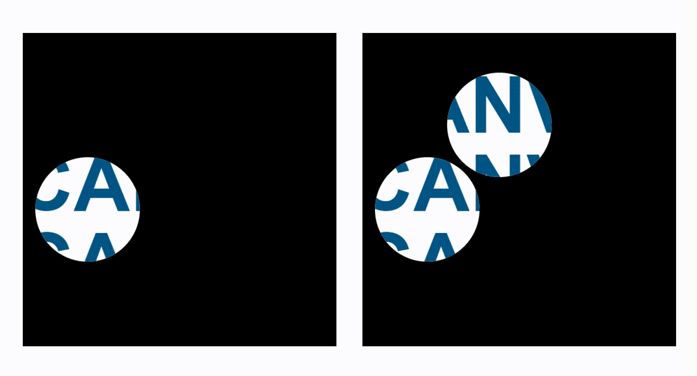
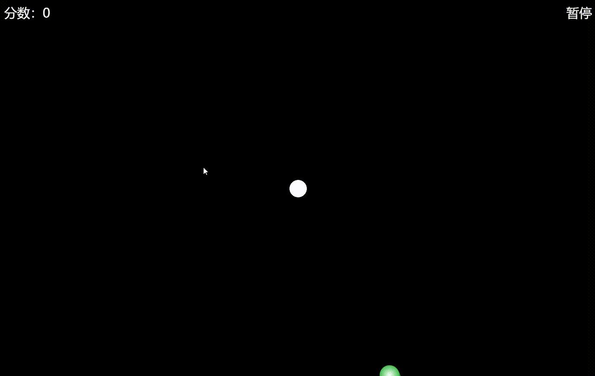

<h1 align="center">sphere-collision</h1>
<div align="center">
一个用于在Canvas上实现球体碰撞和球体交互场景，高可用、高扩展的库。
</div>

## 使用说明

安装

```
npm i sphere-collision
```

使用示例

```
import SphereCollision from "sphere-collision";

const canvasWidth = 600; // 画布宽度
const canvasHeight = 600; // 画布高度
const globuleRadius = 60; // 球半径

const beforeDrawGlobules = (sphereCollision) => {
    const { ctx } = sphereCollision;
    // 绘制整个画布的背景色
    ctx.clearRect(0, 0, canvasWidth, canvasHeight);
    ctx.beginPath();
    ctx.fillStyle = "#000000";
    ctx.fillRect(0, 0, canvasWidth, canvasHeight);
};

const canvas = document.getElementById("myCanvas");
if (canvas) {
    canvas.width = canvasWidth;
    canvas.height = canvasHeight;
    const ctx = canvas.getContext("2d");

    // 实例化SphereCollision对象
    const sphereCollision = new SphereCollision(
        ctx,
        canvas,
        [
            {
                initX: 400,
                initY: 400,
                vx: 6,
                vy: 3,
                radius: globuleRadius,
            },
        ],
        { beforeDrawGlobules }
    );

    // 开使执行动画
    sphereCollision.start();
}
```

## 案例展示

### 1. 探照灯效果



### 2. 球体碰撞交互效果


### 3. 消灭行星小游戏



### 4.各类球体自由落体交互效果


### 5. 炫酷倒计时动画


<br/>

#### 在线体验(PC 端)：[https://hepengwei.github.io/visualization-collection/#/canvas/searchlight](https://hepengwei.github.io/visualization-collection/#/canvas/searchlight)

#### 以上案例源码均在 visualization-collection 开源项目中，github 地址：[https://github.com/hepengwei/visualization-collection](https://github.com/hepengwei/visualization-collection)

## API 文档

**SphereCollisionC**
| 参数（顺序从上往下依次传入） | 数据类型 | 说明 | 默认值 | 是否必需 |
|:------------------------------|:-------------------------------------------------------|:------------------------------|:------------------------|:------|
| ctx | CanvasRenderingContext2D | Context 对象 | null | 是 |
| canvas | HTMLCanvasElement | Canvas 对象 | null | 是 |
| globuleOptionsList | GlobuleOptions[] | 初始化球体的配置列表 | [] | 否 |
| options | SphereCollisionOptions | 配置参数 | SphereCollisionOptions | 否 |
| **属性** | | | | |
| ctx | CanvasRenderingContext2D | Context 对象 | | |
| canvas | HTMLCanvasElement | Canvas 对象 | | |
| frameId | number | requestAnimationFrame 方法返回的 ID | | |
| globuleList | GlobuleC[] | 保存所有球体实例的列表 | | |
| animationState | enum AnimationState{"waitStart","inAnimation","stop"} | 当前动画状态 | | |
| mousePos | MousePos | 当前鼠标在 Canvas 中的位置坐标 | | |
| prevMousePos(v1.1.0 新增) | MousePos | 前一次鼠标在 Canvas 中的位置坐标 | | |
| isMouseDown(v1.1.0 新增) | boolean | 当前鼠标在 Canvas 中是否按下 | | |
| mouseDownPos(v1.1.0 新增) | MousePos | 鼠标在 Canvas 中按下时的位置坐标 | | |
| mouseInGlobuleList(v1.1.0 新增) | GlobuleC[] | 当前鼠标所在球体中的球体实例列表 | | |
| **方法** | | | | |
| start | () => void | 必须调用该方法，Canvas 才渲染，开始执行相关动画 | | |
| createGlobule | (globuleOptions: GlobuleOptions) => Globule | 创建球体实例的方法 | | |
| updateGlobuleList | (newGlobuleList: GlobuleC[]) => void | 更新球体实例列表，用于动态增加或减少球体实例 | | |
| stop | () => void | 停止整个 frame 动画 |
<br/>

**GlobuleOptions**

| 属性                                    | 数据类型                                                   | 说明                                                                                                                                                   | 默认值                                                                              | 是否必需 |
| :-------------------------------------- | :--------------------------------------------------------- | :----------------------------------------------------------------------------------------------------------------------------------------------------- | :---------------------------------------------------------------------------------- | :------- |
| id                                      | any                                                        | 任意值，可存放数据                                                                                                                                     |                                                                                     | 否       |
| initX                                   | number                                                     | 初始 x 坐标（向右为正方向）                                                                                                                            | 0                                                                                   | 否       |
| initY                                   | number                                                     | 初始 y 坐标（向下为正方向）                                                                                                                            | 0                                                                                   | 否       |
| vx                                      | number                                                     | 在水平方向的速度（向右为正方向）                                                                                                                       | 0                                                                                   | 否       |
| vy                                      | number                                                     | 在垂直方向的速度（向下为正方向）                                                                                                                       | 0                                                                                   | 否       |
| radius                                  | number                                                     | 半径                                                                                                                                                   | 10                                                                                  | 否       |
| color                                   | string                                                     | 颜色                                                                                                                                                   | "#666666"                                                                           | 否       |
| isPureColor(v1.1.3 新增)                | boolean                                                    | 是否为纯色                                                                                                                                             | false                                                                               | 否       |
| alpha                                   | number                                                     | 透明度                                                                                                                                                 | 1                                                                                   | 否       |
| alphaChangeV                            | number                                                     | 透明度改变的速度（正数增加，负数减小）                                                                                                                 | 0                                                                                   | 否       |
| bgImg                                   | string                                                     | 背景图片                                                                                                                                               | ""                                                                                  | 否       |
| collisionLossV                          | number                                                     | 碰撞时的速度损失                                                                                                                                       | 0                                                                                   | 否       |
| moveLossV                               | number                                                     | 移动时的速度损失                                                                                                                                       | 0                                                                                   | 否       |
| gDirection                              | "toInit" \| "toBottom" \| "toTop" \| "toLeft" \| "toRight" | 引力方向。"toInit"，指向球体的初始位置；"toBottom"，指向正下方；"toTop"，指向正上方；"toLeft"，指向正左方；"toRight"，指向正右方(后四个为 v1.1.0 新增) |                                                                                     | 否       |
| gCoefficient                            | number                                                     | 引力系数                                                                                                                                               | 0                                                                                   | 否       |
| requiredMouseInteraction                | boolean                                                    | 是否需要鼠标交互                                                                                                                                       | false                                                                               | 否       |
| mouseInteractionBehavior(v1.1.0 新增)   | "over" \| "drag"                                           | 鼠标交互行为。"over"，鼠标穿过；"drag"，鼠标拖拽                                                                                                       | 当 requiredMouseInteraction 为 true 时，默认值为"over"，当为 false 时，则没有默认值 | 否       |
| fixedPos                                | boolean                                                    | 是否固定位置                                                                                                                                           | false                                                                               | 否       |
| receiveOutForce                         | boolean                                                    | 是否接受外力                                                                                                                                           | true                                                                                | 否       |
| receiveWallForce                        | boolean                                                    | 是否接受墙的力（与墙体发生碰撞）                                                                                                                       | true                                                                                | 否       |
| resistanceWallDirection(v1.1.3 新增)    | Direction[]                                                | 有阻力的墙的方向                                                                                                                                       | ["bottom", "top", "left", "right"]                                                  | 否       |
| onlyCheckCollision                      | boolean                                                    | 当不接受外力时，是否检测碰撞（检测碰撞相关状态但不获取外力）                                                                                           | false                                                                               | 否       |
| perfectlyElasticCollision(v1.1.10 新增) | boolean                                                    | 是否完全弹性碰撞                                                                                                                                       | false                                                                               | 否       |
| maxMouseOutForce                        | number                                                     | 鼠标交互时能提供的最大力限制                                                                                                                           | null                                                                                | 否       |
| maxMoveV                                | number                                                     | 最大移动速度                                                                                                                                           | null                                                                                | 否       |
| beforeDrawGlobule                       | (globule: GlobuleC) => void                                | 每一帧绘制该球体之前执行的钩子函数                                                                                                                     | null                                                                                | 否       |
| afterDrawGlobule                        | (globule: GlobuleC) => void                                | 每一帧绘制该球体之后执行的钩子函数                                                                                                                     | null                                                                                | 否       |
| afterCalculateNextFrameGlobule          | (nextFrameGlobule: GlobuleC) => void                       | 每一帧绘制球体后,计算并修改为下一帧状态后执行的钩子函数                                                                                                | null                                                                                | 否       |

<br/>

**SphereCollisionOptions**

| 属性                            | 数据类型                                                       | 说明                                                  |               |     |
| :------------------------------ | :------------------------------------------------------------- | :---------------------------------------------------- | :------------ | :-- |
| collisionRectX                  | number                                                         | 球体发生碰撞的矩形区域的左上角 x 坐标（向右为正方向） | 0             | 否  |
| collisionRectY                  | number                                                         | 球体发生碰撞的矩形区域的左上角 y 坐标（向下为正方向） | 0             | 否  |
| collisionRectWidth              | number                                                         | 球体发生碰撞的矩形区域的宽度                          | canvas.width  | 否  |
| collisionRectHeight             | number                                                         | 球体发生碰撞的矩形区域的高度                          | canvas.height | 否  |
| monitorMousePos                 | boolean                                                        | 是否监听鼠标的位置                                    | false         | 否  |
| beforeDrawGlobules              | (sphereCollision: SphereCollisionC) => void                    | 每一帧绘制所有球体之前执行的钩子函数                  | null          | 否  |
| afterDrawGlobules               | (sphereCollision: SphereCollisionC) => void                    | 每一帧绘制所有球体之后执行的钩子函数                  | null          | 否  |
| onMouseDownCanvas(v1.1.0 新增)  | (event: MouseEvent, sphereCollision: SphereCollisionC) => void | 鼠标按下时执行的钩子函数                              | null          | 否  |
| onMouseMoveCanvas(v1.1.0 新增)  | (event: MouseEvent, sphereCollision: SphereCollisionC) => void | 鼠标移动时执行的钩子函数                              | null          | 否  |
| onMouseUpCanvas(v1.1.0 新增)    | (event: MouseEvent, sphereCollision: SphereCollisionC) => void | 鼠标松开时执行的钩子函数                              | null          | 否  |
| onMouseLeaveCanvas(v1.1.0 新增) | (event: MouseEvent, sphereCollision: SphereCollisionC) => void | 鼠标离开时执行的钩子函数                              | null          | 否  |

<br/>

**MousePos**

| 属性   | 数据类型       | 说明                                      |
| :----- | :------------- | :---------------------------------------- |
| mouseX | number \| null | 鼠标在 Canvas 中的 x 坐标（向右为正方向） |
| mouseY | number \| null | 鼠标在 Canvas 中的 y 坐标（向下为正方向） |

<br/>

**Direction**

| 属性      | 数据类型                               | 说明 |
| :-------- | :------------------------------------- | :--- |
| Direction | "bottom" \| "top" \| "left" \| "right" | 方向 |

<br/>

**GlobuleC**

| 属性                                    | 数据类型                                                                       | 说明                                                                                                                                                   |
| :-------------------------------------- | :----------------------------------------------------------------------------- | :----------------------------------------------------------------------------------------------------------------------------------------------------- |
| id                                      | any                                                                            | 任意值,可存放数据                                                                                                                                      |
| ctx                                     | CanvasRenderingContext2D                                                       | Context 对象                                                                                                                                           |
| canvas                                  | HTMLCanvasElement                                                              | Canvas 对象                                                                                                                                            |
| requiredMouseInteraction                | boolean                                                                        | 是否需要鼠标交互                                                                                                                                       |
| mouseInteractionBehavior(v1.1.0 新增)   | "over" \| "drag"                                                               | 鼠标交互行为。"over"，鼠标穿过；"drag"，鼠标拖拽                                                                                                       |
| maxMouseOutForce                        | number \| null                                                                 | 鼠标交互时能提供的最大力限制                                                                                                                           |
| initX                                   | number                                                                         | 初始 x 坐标（向右为正方向）                                                                                                                            |
| initY                                   | number                                                                         | 初始 y 坐标（向下为正方向）                                                                                                                            |
| x                                       | number                                                                         | x 坐标（向右为正方向）                                                                                                                                 |
| y                                       | number                                                                         | y 坐标（向下为正方向）                                                                                                                                 |
| previousX(v1.1.8 新增)                  | number \| null                                                                 | 前一帧 x 坐标（向右为正方向）                                                                                                                          |
| previousY(v1.1.8 新增)                  | number \| null                                                                 | 前一帧 y 坐标（向右为正方向）                                                                                                                          |
| vx                                      | number                                                                         | 在水平方向的速度（向右为正方向）                                                                                                                       |
| vy                                      | number                                                                         | 在垂直方向的速度（向下为正方向）                                                                                                                       |
| radius                                  | number                                                                         | 半径                                                                                                                                                   |
| color                                   | string                                                                         | 颜色                                                                                                                                                   |
| isPureColor(v1.1.3 新增)                | boolean                                                                        | 是否为纯色                                                                                                                                             |
| alpha                                   | number                                                                         | 透明度                                                                                                                                                 |
| alphaChangeV                            | number                                                                         | 透明度改变的速度（正数增加，负数减小）                                                                                                                 |
| bgImg                                   | string                                                                         | 背景图片                                                                                                                                               |
| collisionLossV                          | number                                                                         | 碰撞时的速度损失                                                                                                                                       |
| moveLossV                               | number                                                                         | 移动时的速度损失                                                                                                                                       |
| gDirection                              | "toInit" \| "toBottom" \| "toTop" \| "toLeft" \| "toRight"                     | 引力方向。"toInit"，指向球体的初始位置；"toBottom"，指向正下方；"toTop"，指向正上方；"toLeft"，指向正左方；"toRight"，指向正右方(后四个为 v1.1.0 新增) |
| gCoefficient                            | number                                                                         | 引力系数                                                                                                                                               |
| fixedPos                                | boolean                                                                        | 是否固定位置                                                                                                                                           |
| receiveOutForce                         | boolean                                                                        | 是否接受外力                                                                                                                                           |
| receiveWallForce                        | boolean                                                                        | 是否接受墙的力（与墙体发生碰撞）                                                                                                                       |
| resistanceWallDirection(v1.1.3 新增)    | Direction[]                                                                    | 有阻力的墙的方向                                                                                                                                       |
| onlyCheckCollision                      | boolean                                                                        | 当不接受外力时，是否检测碰撞（检测碰撞相关状态但不获取外力）                                                                                           |
| perfectlyElasticCollision(v1.1.10 新增) | boolean                                                                        | 是否完全弹性碰撞                                                                                                                                       |
| mousePos                                | MousePos                                                                       | 鼠标相对于 canvas 的位置坐标                                                                                                                           |
| maxMoveV                                | number \| null                                                                 | 最大移动速度                                                                                                                                           |
| controlledByMouse(v1.1.0 新增)          | boolean                                                                        | 当前是否受鼠标控制(被鼠标拖拽)                                                                                                                         |
| inCollisionGlobule                      | boolean                                                                        | 是否与其他球体发生碰撞的状态                                                                                                                           |
| inCollisionGlobuleList                  | GlobuleC[]                                                                     | 与其他球体碰撞的其他球体实例列表                                                                                                                       |
| inCollisionWall                         | boolean                                                                        | 是否与墙体发生碰撞的状态                                                                                                                               |
| beforeDrawGlobule                       | (globule: GlobuleC) => void \| null                                            | 每一帧绘制该球体之前执行的钩子函数                                                                                                                     |
| afterDrawGlobule                        | (globule: GlobuleC) => void \| null                                            | 每一帧绘制该球体之后执行的钩子函数                                                                                                                     |
| afterCalculateNextFrameGlobule          | (nextFrameGlobule: GlobuleC) => void \| null                                   | 每一帧绘制球体后,计算并修改为下一帧状态后执行的钩子函数                                                                                                |
| **方法**                                |                                                                                |                                                                                                                                                        |
| addOutForce                             | (outForceVX: number, outForceVY: number, isCollision?:boolean = false) => void | 添加外力。用于动态增加或减小球体的速度                                                                                                                 |

## 特别说明

- 球体的 fixedPos 属性为 true 时， 获取不了外力，所以球体不会移动，但还是会使其他球体受到外力，进行反弹。
- 球体的 receiveOutForce 属性为 false 时，获取不了鼠标穿过和其他球体碰撞产生的外力，即使另一个球体的 receiveOutForce 属性为 true。
- 球体的 receiveWallForce 属性为 false 时，获取不了来自墙体的外力，所以不会与墙体发生碰撞。
- 球体的 beforeDrawGlobule 和 afterDrawGlobule 两个钩子函数，主要作用是在绘制球体之前和之后分别去绘制其他元素，而 afterCalculateNextFrameGlobule 钩子函数是用于做一些其他的逻辑判断，因为只有这个函数里拿到的球体实例是带有是否发生碰撞等相关信息的
- 如果实例化 SphereCollision 对象时传入了 beforeDrawGlobules 钩子函数，并且需要在每一帧绘制前要清除整个画布，则需要使用者自己清除，这是考虑到有些不需要清除的场景。
- 如果要获取鼠标相关的信息或者想要实现鼠标交互，实例化 SphereCollision 对象时就必须在第四个参数 options 中传入 monitorMousePos 为 true。
- 如果给球体配置了 gDirection 和 gCoefficient 属性，建议就不要配置 collisionLossV 了。
- 非完全弹性碰撞会有速度的抵消，可能碰撞后的 x 轴或 y 轴方向上的速度相互抵消为 0，球体可能会停下来；完全弹性碰撞则不会有速度的抵消，速度大小不会改变(速度为 0 除外，速度为 0 的，碰撞后会和撞它的另一球的速度大小一致)，碰撞后仅改变方向; 在碰撞时如果其中有一个球体的 perfectlyElasticCollision 为 true，则两球均使用完全弹性碰撞算法进行计算。
- 如果需要的话，可以在任何时候动态地修改球体实例的所有属性值，以满足自己的自定义需求。

## 关键版本更新日志

- v1.1.10

1. 新增支持球体完全弹性碰撞
2. 优化代码

- v1.1.8

1. 优化碰撞算法
2. 解决一些已知 bug

- v1.1.3

1. 新增支持纯色球体
2. 新增支持四面墙中只有部分墙面有阻力，与球体发生碰撞
3. 解决一些已知 bug

- v1.1.0

1. 考虑后续的功能扩展，修改了 SphereCollision 类的参数，将之前的第四个及之后的参数都统一放到 options 对象中，并作为第四个参数传入。
2. 新增支持上下左右四个引力方向
3. 新增支持球体进行鼠标拖拽交互
4. 新增的相关属性及方法可自行查阅 API 文档
   <br/>
